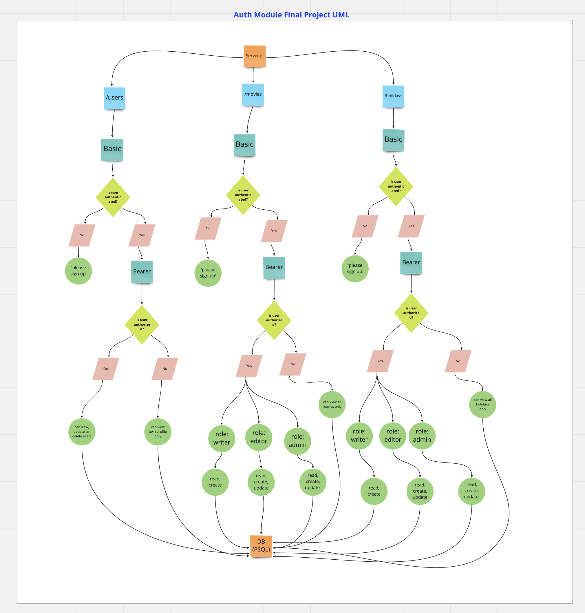
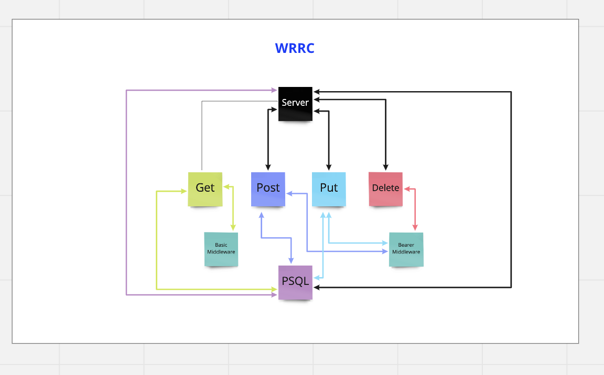

# authFinal

<!-- Add reqs -->

### Authors: Mark Thanadabouth and Jeremy Brazell

#### Links and Resources
<!-- [Deployed Link](https://mt-bearer-auth-dev.herokuapp.com/) -->

### Setup

#### `.env` requirements
- `PORT` - \<reference sample.env>
- `DATABASE_URL` - \<reference sample.env>
- `SECRET` - \<reference sample.env>

#### Running App
- `npm start` or `nodemon`

#### Endpoints
- /signup
- /signin
  - Basic Auth
- /users
  - Bearer Auth: Admin role only: view, update, create and delete
- /movie
  - Basic Auth: User can view movies
  - Bearer Auth: Writer can view and create movies
  - Bearer Auth: Editor can view, create, and update movies
  - Bearer Auth: Admin can view, create, updated, and delete movies

#### Tests
- Console logs are commented out but were used for testing
- `npm test`

### UML/WRRC

